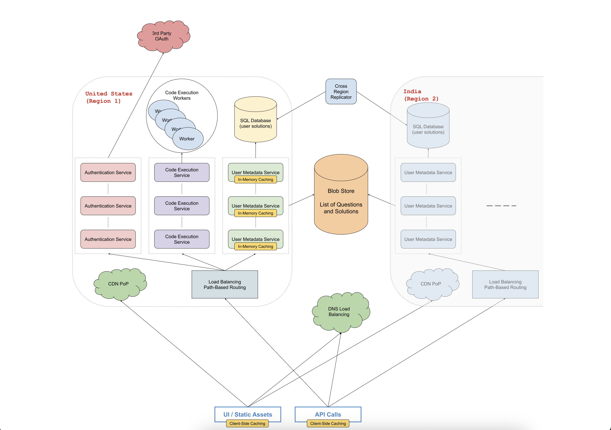

# Design Slack

Many systems design questions are intentionally left vague and are literally given in the form of `Design Foobar`.
It's your job to ask clarifying questions to better understand the system that you have to build.

We've laid out some of these questions below; their answers should give you guidance on the problem.
Before looking at them, take a few minutes to think about what questions you'd ask in a real interview.

## Clarifying Questions To Ask

### Question 1

Q: There are a lot of things that you can do on Slack. Primarily, you use Slack to communicate with people in one-on-one channels,
private channels, or public channels, all within an organization. But you can also do a bunch of other things on Slack, like create
and delete channels, change channel settings, change Slack settings, invite people to channels, etc.. What exactly are we designing here?

A: We're designing the core messaging functionality, which involves communicating in both one-on-one channels and group channels in an
organization. You don't have to worry about channel settings and all of those extra functionalities.

### Question 2

Q: Okay. Do you want me to take care of the concept of private channels at all?

A: Let's just focus on users in a channel as far as access control is concerned; we can forget about the concept of a private channel.

### Question 3

Q: Okay. And regarding communication, from my knowledge of Slack, when you load the web app or the desktop / mobile apps, you can
obviously access all the messages of channels that you're in (including one-on-one channels), but you're also notified of channels that
have unread messages for you and of the number of unread mentions that you have in each channel. Channels with unread messages are bold,
if I remember correctly, and the number of unread mentions is simply visible next to channel names. Should we design our system to
accommodate this?

A: Yes, we should take care of this. And on that note, one thing we'll want to handle is cross-device synchronization. In other words,
if you have both the Slack desktop app and the Slack mobile app open, and both apps are showing that one channel is unread, and you read
that channel on one of the apps, the other app should immediately get updated and should mark the channel as read. You'll have to handle this.

### Question 4

Q: Hmm, okay. Speaking of different applications, by the way, are we designing the various device / software apps, or just the backend
systems that the frontends / clients communicate with?

A: You'll only really focus on the backend systems for this question.

### Question 5

Q: Okay. Also, there are a lot of different features in actual Slack messages. For example, adding custom emojis, pinning messages,
saving messages, writing code snippets or text-blocks, etc.. Do you want me to handle all of this?

A: No, you can just treat messages as pure text for now. Of course, what you'll design will likely be extensible to different types of
messages and will eventually be able to handle things like pinning or saving messages, but for this design, don't worry about that.

### Question 6

Q: How many users do we expect to be building this for? And how large is the largest organization on Slack? How many users does it have?

A: Slack has about 10 to 20 million users, so let's go with 20 million. And as for organizations, let's say that the largest single Slack
customer has 50,000 people in the same organization. We can also approximate that the largest channel will be of that same size if all of
an organization's employees are in the same channel (the typical #general channel, for example).

### Question 7

Q: Since this is a chat application, I'm assuming that low latency is one of our top priorities, and also, since this service impacts
millions of users, I'm assuming that we should design with high availability in mind. Are these correct assumptions?

A: Yes to both of those things, but for the sake of being a little more focused, don't worry about optimizing for availability. Let's
focus primarily on latency and core functionality.

### Question 8

Q: Okay. And are we building this for a global audience, or should we focus on a single region?

A: Let's handle a single region for this question, but just like with availability, don't focus too much on this aspect of the design.

---

## 1. Gathering System Requirements

As with any systems design interview question, the first thing that we want to do is to gather system requirements; we need to figure out
what system we're building exactly.

From the answers we were given to our clarifying questions, we're building the core Slack messaging flow: landing in the application,
accessing channels, seeing unread indicators and mention counts, sending messages, receiving messages, and having read state synchronized
across devices.

We don't need to worry about payments or authentication flows here, and we don't need to go deep into advanced message features (rich
formatting, pins, saves, custom emojis).

We're building this platform for a (single-region) audience, and we don't need to overly optimize our system's availability in this
exercise. Two to three nines would be reasonable for a production chat system, but we'll focus on latency and functional correctness.

We care about latency and throughput within reason—real-time delivery and quick unread state updates are key.

## 2. Coming Up With A Plan

It's important to organize ourselves and to lay out a clear plan regarding how we're going to tackle our design. What are the major,
distinguishable components of the system?

We can divide our system into core functional areas:

- Channel membership and listing (seeing channels the user belongs to).
- Loading and paginating channel messages.
- Tracking unread messages and unread mention counts per channel per user.
- Real-time message delivery (publish/subscribe and push to clients).
- Cross-device read-state synchronization.

## 3. Static UI Content

For static UI assets (images, JavaScript bundles, CSS), we can store them in a blob store such as S3 or Google Cloud Storage. To optimize
latency for users, a Content Delivery Network (CDN) should serve these assets, reducing round-trip time, especially for mobile users on
slower connections.

## 4. Backend Clusters And Load Balancing

We can deploy a cluster of API servers behind a load balancer. DNS or layer-7 load balancing can distribute requests. Within the cluster,
path-based routing can separate services (e.g., messaging, presence, mentions, read-state). Round-robin (or least-connections) load
balancing can be used per service pool.

## 5. Persistent Data Model Overview

We need persistent storage for channels, channel membership, messages, read receipts, and mention counts.

Suggested tables (SQL):

- channels(id PK, org_id, name, created_at)
- channel_members(id PK, channel_id FK, user_id FK, joined_at)
- messages(id PK, channel_id FK, sender_id FK, sent_at, body TEXT, mentions ARRAY<user_id>)
- read_receipts(id PK, channel_id FK, user_id FK, last_seen TIMESTAMP)
- mention_counts(id PK, channel_id FK, user_id FK, unread_mentions INT)

Indexes:

- messages(channel_id, sent_at)
- read_receipts(channel_id, user_id)
- mention_counts(channel_id, user_id)

## 6. Caching Strategy

Two layers of caching improve performance:

- Client-side caching of recently loaded channels and messages to reduce redundant fetches during a session.
- Server-side in-memory caching (e.g., Redis or in-process LRU) for channel metadata, last message pointers, and unread counts. This lowers
database read load and speeds up sidebar rendering.

Cache invalidation triggers:

- New message sent (update channel last-active and unread counts for recipients).
- Channel read event (reset unread count and mention count for that user in that channel).

## 7. Access Control

Access control: only members of a channel should be allowed to fetch its messages or modify state. Simple membership verification can
precede message queries. Private vs public channel distinction is omitted; membership list suffices as the ACL.

## 8. Message Flow

Steps when sending a message:

1. Client POSTs message body (and optional explicit mentions) to /channels/{id}/messages.
2. API server validates membership and rate limits if necessary.
3. Persist message row; extract @mentions to populate mentions array.
4. For each mentioned user, increment unread_mentions in mention_counts (or mark for async update).
5. Mark all other channel members (except sender) as having unread messages (update or compute unread status via last_seen < message.sent_at heuristic).
6. Publish event on a Pub/Sub topic (e.g., Kafka: org-channel partition key).
7. Real-time delivery service pushes event over WebSocket to connected clients; offline clients will fetch on next load.

## 9. Read-State Synchronization

When a user opens a channel:

- Update read_receipts.last_seen to latest message timestamp (transactionally).
- Reset mention_counts.unread_mentions for that user & channel to 0.
- Publish a read-receipt event so other open devices for the same user clear the unread badge.

Idempotency: Using timestamps makes repeated updates harmless—setting last_seen to max(current, new) keeps state consistent.

## 10. Real-Time Transport

Use persistent WebSocket (or HTTP/2 stream) connections:

- One connection per logged-in device to a real-time gateway.
- Gateway subscribes to relevant Kafka topics (partitioned by org or channel).
- Gateway filters events per user (only channels user belongs to) and emits JSON payloads: message, read-receipt, mention-update.

Fallback: Long-polling if WebSocket unavailable.

## 11. Scaling Considerations

- Sharding: Partition messages by organization (and within large orgs by channel hash) to keep index sizes manageable.
- Storage: Messages can grow large—implement TTL or archival for very old messages if necessary (out of scope now).
- Backpressure: Apply producer throttling if consumer lag exceeds threshold; store overflow in durable queue.
- Rate Limiting: Per-user message send limits (e.g., X messages per minute) to prevent spam.

## 12. System Diagram

## 13. Logging & Monitoring

Metrics:

- Message send latency (API receipt -> real-time delivery).
- WebSocket connection counts & per-user concurrent devices.
- Lag between latest Kafka offset and consumer processed offset.
- Unread badge accuracy (sample audits comparing cached counts vs recomputed counts).

Alerts:

- High consumer lag.
- Elevated message send failures.
- Spike in rate-limit violations (possible abuse).

## 14. Future Extensions

- Support rich message types (files, reactions) via additional tables (files, reactions).
- Global multi-region replication & locality routing.
- Conversation search index (Elastic / OpenSearch) built from message stream.

---

This Markdown version removes all inline HTML elements and wraps lines to satisfy length constraints while preserving original intent and
expanding Slack-specific design details where generic placeholders existed.
