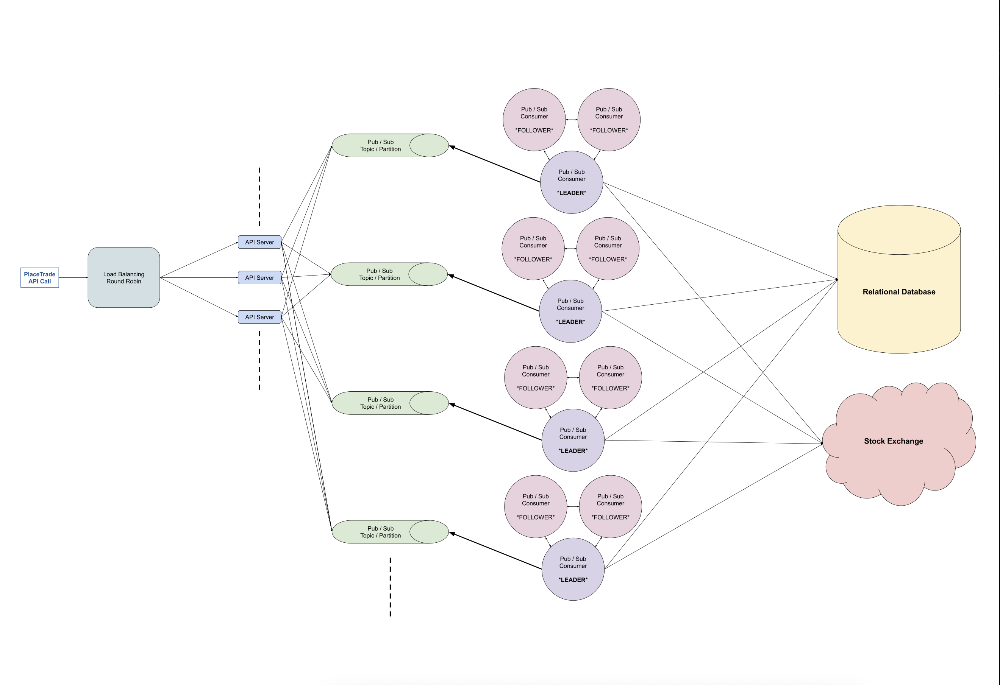

# Design A Stockbroker

Design a stockbroker: a platform that acts as the intermediary between end customers and a central stock exchange.

Many systems design questions are intentionally left very vague and are literally given in the form of `Design Foobar`.
It's your job to ask clarifying questions to better understand the system that you have to build.

We've laid out some of these questions below; their answers should give you guidance on the problem.
Before looking at them, take a few minutes to think about what questions you'd ask in a real interview.

## Clarifying Questions To Ask

### Question 1

Q: What do we mean exactly by a stock broker? Is this something like Robinhood or Etrade?

A: Yes, exactly.

### Question 2

Q: What is the platform supposed to support exactly? Are we just supporting the ability for customers to buy and sell stocks, or are we supporting more?
For instance, are we allowing other types of securities like options and futures to be traded on our platform?
Are we supporting special types of orders like limit orders and stop losses?

A: We're only supporting market orders on stocks in this design.
A market order means that, given a placed order to buy or sell a stock, we should try to execute the order as soon as possible
regardless of the stock price.
We also aren't designing any "margin" system, so the available balance is the source of truth for what can be bought.

### Question 3

Q: Are we designing any of the auxiliary aspects of the stock brokerage, like depositing and withdrawing funds, downloading tax documents, etc.?

A: No — we're just designing the core trading aspect of the platform.

### Question 4

Q: Are we just designing the system to place trades? Do we want to support other trade-related operations like getting trade statuses?
In other words, how comprehensive should the API that's going to support this platform be?

A: In essence, you're only designing a system around a PlaceTrade API call from the user,
but you should define that API call (inputs, response, etc.).

### Question 5

Q: Where does a customer's balance live? Is the platform pulling a customer's money directly from their bank account,
or are we expecting that customers will have already deposited funds into the platform somehow?
In other words, are we ever directly interacting with banks?

A: No, you won't be interacting with banks.
You can assume that customers have already deposited funds into the platform, and you can further assume that you have a
SQL table with the balance for each customer who wants to make a trade.

### Question 6

Q: How many customers are we building this for? And is our customer base a global one?

A: Millions of customers, millions of trades a day.
Let's assume that our customers are only located in one region — the U.S., for instance.

### Question 7

Q: What kind of availability are we looking for?

A: As high as possible; with this kind of service people can lose a lot of money if the system is down even for a few minutes.

### Question 8

Q: Are we also designing the UI for this platform? What kinds of clients can we assume we have to support?

A: You don't have to design the UI, but you should design the PlaceTrade API call that a UI would be making to your backend.
Clients would be either a mobile app or a web app.

### Question 9

Q: So we want to design the API for the actual brokerage, that itself interacts with some central stock exchange on behalf of customers.
Does this exchange have an API? If yes, do we know what it looks like, and do we have any guarantees about it?

A: Yes, the exchange has an API, and your platform's API (the PlaceTrade call) will have to interact with the exchange's API.
You can assume that the call to the exchange to make an actual trade will take in a callback
(in addition to the info about the trade).
That callback will be executed when the trade completes at the exchange level (FILLED or REJECTED).
You can also assume that the exchange's system is highly available—your callback will always get executed at least once.

---

## 1. Gathering System Requirements

As with any systems design interview question, the first thing that we want to do is to gather system requirements.
We need to figure out what system we're building exactly.

We're building a stock-brokerage platform like Robinhood that functions as the intermediary between end-customers and some central stock exchange.
The idea is that the central stock exchange is the platform that actually executes stock trades.
The stockbroker is the platform that customers talk to when they want to place a trade—the brokerage is "simpler" and more human-readable.

We only care about supporting market trades—trades that are executed at the current stock price.
We can assume that our system stores customer balances (funds previously deposited) in a SQL table.

We need to design a *PlaceTrade* API call, and the central exchange's equivalent API method will take in a callback
that's guaranteed to run when the trade finishes.

We're designing this system to support millions of trades per day coming from millions of customers in a single region (the U.S., for example).
We want the system to be highly available.

## 2. Coming Up With A Plan

It's important to organize ourselves and lay out a clear plan for the design.
What are the major, distinguishable components of our system?

We'll approach the design front to back:

- The *PlaceTrade* API call that clients will make.
- The API server(s) handling client API calls.
- The system in charge of executing orders for each customer.

We need to ensure:

- Trades can never be stuck forever without either succeeding or failing.
- A single customer's trades are executed in the order they were placed.
- Balances can never go negative.

## 3. API Call

The core API call that we have to implement is *PlaceTrade*.

Signature:

```text
PlaceTrade(
  customerId: string,
  stockTicker: string,
  type: string (BUY/SELL),
  quantity: integer,
) => (
  tradeId: string,
  stockTicker: string,
  type: string (BUY/SELL),
  quantity: integer,
  createdAt: timestamp,
  status: string (PLACED),
  reason: string,
)
```

The customer ID can be derived from an authentication token known only to the user and passed into the API call.

Status values:

- PLACED
- IN PROGRESS
- FILLED
- REJECTED

Note: PLACED will be the immediate status; other statuses are set asynchronously when the exchange executes our callback.
A hypothetical *GetTrade* call could return statuses other than PLACED.

Potential REJECTED reasons:

- insufficient funds
- random error
- past market hours

## 4. API Server(s)

We'll need multiple API servers to handle incoming requests.
We don't need caching for trades, so we don't need server stickiness; round-robin load balancing is fine.

Once servers receive a *PlaceTrade* call, they store the trade in a SQL table.
That table must live in the same database as the balances table so ACID transactions can atomically modify both.

**Trades table schema:**

- id: string (random, auto-generated)
- customer_id: string
- stockTicker: string (ticker symbol)
- type: string (BUY or SELL)
- quantity: integer (no fractional shares)
- status: string (starts as PLACED)
- created_at: timestamp
- reason: string (human-readable justification of status)

**Balances table schema:**

- id: string (random, auto-generated)
- customer_id: string
- amount: float (USD balance)
- last_modified: timestamp

## 5. Trade-Execution Queue

Hundreds of orders can arrive each second, so the trades table grows quickly.
We need a robust way to execute trades and update the table while ensuring:

- For a single customer, only one BUY trade is processed at a time (avoid negative balances).
- For market orders, the execution price isn't known until the exchange responds.

Use a Publish/Subscribe pattern via a message queue (Kafka or Pub/Sub).
Map customer IDs to topics via hashing for parallelism and at-least-once delivery.
When a trade is placed, the server writes a row and publishes a message to the customer's topic.

This guarantees that for a single customer, only one thread processes their trades at a time.

Subscribers can be clusters (rings) of ~3 workers with leader election.
The leader pulls messages and executes trades via the exchange.
A customer's trades always go to the same cluster, simplifying logic.

Estimation:

Millions of trades per day ≈ 30 trades/sec (bunched in 1/3 of the day, ~1,000,000 trades).

```text
~100,000 seconds per day (3600 * 24)
~1,000,000 trades per day
trades bunched in 1/3rd of the day
--> (1,000,000 / 100,000) * 3 ≈ 30 trades per second
```

If execution logic takes ~1 second, we need roughly 10–100 topics and clusters for parallelism.

## 6. Trade-Execution Logic

Workers stream / wait for messages. Example message:

```json
{"customerId": "c1"}
```

Pseudo-code:

```text
// Get oldest non-terminal trade.
trade = SELECT * FROM trades
  WHERE customer_id = 'c1'
    AND (status = 'PLACED' OR status = 'IN PROGRESS')
  ORDER BY created_at ASC LIMIT 1;

// Transition to IN PROGRESS if currently PLACED.
if trade.status == 'PLACED' {
  UPDATE trades SET status = 'IN PROGRESS' WHERE id = trade.id;
}

// If already exists at exchange, callback will finish it.
if exchange.TradeExists(trade.id) { return; }

// Fetch balance.
balance = SELECT amount FROM balances WHERE customer_id = 'c1';

// Prepare callback (defined later) and execute.
callback = ...

exchange.Execute(
  trade.stockTicker,
  trade.type,
  trade.quantity,
  max_price = balance,
  callback,
)
```

## 7. Exchange Callback

Pseudo-code for callback:

```text
function exchange_callback(exchange_trade) {
  if exchange_trade.status == 'FILLED' {
    BEGIN TRANSACTION;
    trade = SELECT * FROM trades WHERE id = database_trade.id;
    if trade.status <> 'IN PROGRESS' {
      ROLLBACK;
      pubsub.send({customer_id: database_trade.customer_id});
      return;
    }
    UPDATE balances
      SET amount = amount - exchange_trade.amount
      WHERE customer_id = database_trade.customer_id;
    UPDATE trades SET status = 'FILLED' WHERE id = database_trade.id;
    COMMIT;
  } else if exchange_trade.status == 'REJECTED' {
    BEGIN TRANSACTION;
    UPDATE trades SET status = 'REJECTED' WHERE id = database_trade.id;
    UPDATE trades SET reason = exchange_trade.reason WHERE id = database_trade.id;
    COMMIT;
  }
  pubsub.send({customer_id: database_trade.customer_id});
  return http.status(200);
}
```

## 8. System Diagram


