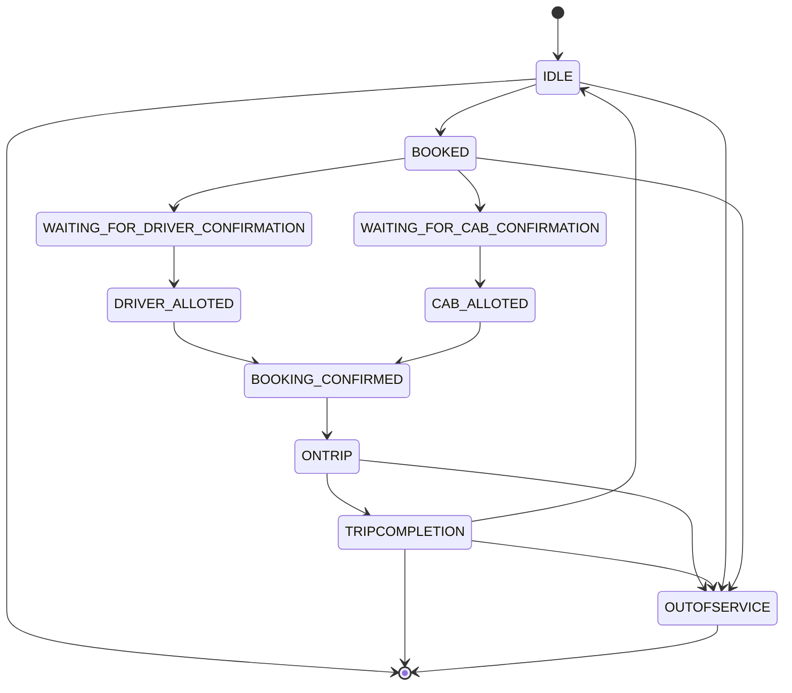

# Cab Management System

## Problem Definition

You have to build an inter city cab management portal to be used as an admin and booking tool.

## Capabilities

1. Register cabs.
2. Onboard various cities where cab services are provided.
3. Change current city (location) of any cab.
4. Change state of any cab. For this you will have to define a state machine for the cab; a cab must have at least these two basic states: IDLE and ON_TRIP.
5. Book cabs based on their availability at a certain location. In case more than one cab is available, use the following strategy:
   a. Find out which cab has remained idle the most and assign it.
   b. In case of a tie, randomly assign any cab.

Assumption: a cab once assigned a trip cannot cancel/reject it.

## Other Details

Input: a snapshot of all cabs with their metadata and location: a List of <Cab_Id, Cab_State, City_Id>.
In case the Cab_State is ON_TRIP, the City_Id will be indeterminate.

## Bonus

1. Provide insights such as for how much time was a cab idle in a given duration.
2. Keep a record of the cab history of each cab (states traversed).
3. Find cities where the demand for cabs is high and the time when the demand is highest.

## Expectations

1. Clean, functionally correct code.
2. Code should be extensible and unit testable.
3. It should be properly designed.
4. Don’t create any interactive UI.

### Swagger API Reference

### DB ER Diagram

### Cab State Machine

- Cab inventory has list of registered cabs.
- It also has cab status active/inactive which means in-service/out-of-service.

